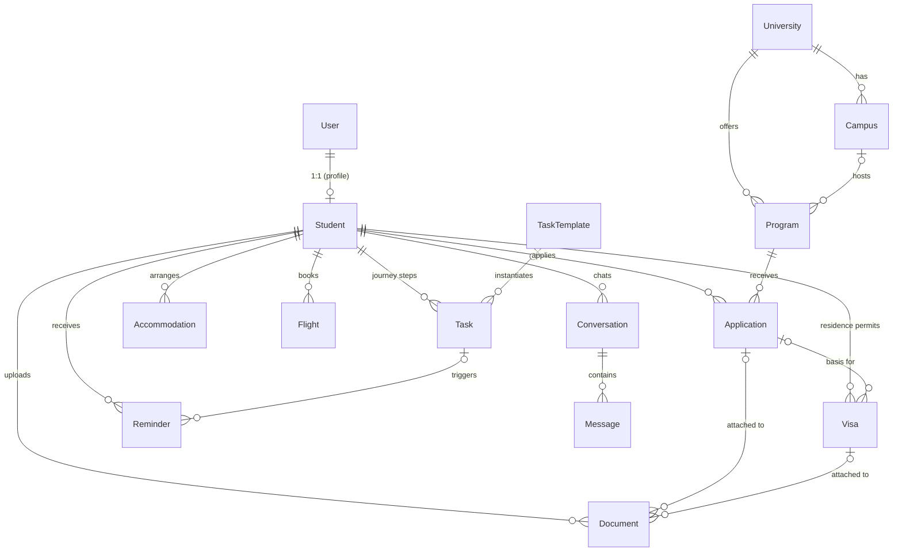

# Wayfara — Database Schema

The full domain schema, live in PostgreSQL (cluster `16/finnguide`, port 5433)
as of this document. Models are grouped into five Django apps by domain.

## Entity-relationship overview

## App: `accounts`

### User
Auth + entitlement only — the domain profile lives on `Student`.

| Field | Type | Notes |
|---|---|---|
| `email` | varchar, **unique** | The login; no username field |
| `password` | varchar | Hashed (Django) |
| `first_name`, `last_name` | varchar | |
| `tier` | enum: `free` / `full` / `premium` | **Account-level entitlement.** Read-only via API; only the payment webhook changes it |
| `is_active/staff/superuser`, `date_joined`, `last_login` | | Django standard |

## App: `students`

### Student
1:1 with `User` (created lazily on first profile access). Mirrors Phase 0 onboarding.

| Field | Type | Notes |
|---|---|---|
| `user` | FK → User, **1:1**, CASCADE | |
| `nationality` | varchar | default "Pakistan" |
| `phone`, `home_city` | varchar | |
| `study_level` | enum: `undergraduate` / `masters` | |
| `field_of_study` | varchar | |
| `grades` | varchar | GPA / percentage / A-Levels, as entered |
| `language_test_status` | enum: `not_taken` / `booked` / `taken` | |
| `language_test_score` | varchar | |
| `budget_eur_per_year` | int, nullable | null = tuition-free only |
| `intake` | enum: `september` / `january` | |
| `intake_year` | smallint | |
| `stage` | enum: `exploring` / `ready` / `applied` | |
| `current_phase` | smallint 0–6 | Journey position; API read-only |
| `onboarding_completed` | bool | |

### Document
| Field | Type | Notes |
|---|---|---|
| `student` | FK → Student, CASCADE | |
| `doc_type` | enum (14 values) | passport, photo, transcript, degree/language certificates, bank_statement, sponsor_letter, health_insurance, acceptance_letter, tuition_receipt, accommodation_proof, cv, motivation_letter, other |
| `file` | file | Local `media/` in dev; S3/R2 in production |
| `status` | enum | `uploaded` / `ai_reviewed` / `issues_found` / `verified` |
| `ai_review` | JSON, nullable | Premium AI reviewer findings + fixes (PRD §6.3) |
| `expires_at` | date, nullable | Passport expiry — Migri wants 15+ months validity |
| `application` | FK → Application, nullable, SET_NULL | A doc can belong to an application package… |
| `visa` | FK → Visa, nullable, SET_NULL | …or a visa package, or neither |

Index: `(student, doc_type)`.

### TaskTemplate — admin-editable content (the PRD's CMS mitigation)
| Field | Type | Notes |
|---|---|---|
| `phase` | smallint 0–6 | |
| `title`, `description` | | |
| `why_it_matters` | text | Every step explains WHY — PRD trust principle |
| `order` | smallint | Position within phase |
| `offset_anchor` | enum | `application_deadline` / `offer_deadline` / `visa_submission` / `intake_start` / `arrival` |
| `offset_days` | int | Relative to anchor; negative = before. The timeline engine computes due dates from this |
| `is_critical`, `is_active` | bool | |

### Task — per-student instance
| Field | Type | Notes |
|---|---|---|
| `student` | FK → Student, CASCADE | |
| `template` | FK → TaskTemplate, nullable, SET_NULL | null = custom task |
| `phase`, `title`, `description`, `order` | | Copied from template at generation time |
| `due_date` | date, nullable | Computed by the timeline engine |
| `status` | enum | `pending` / `in_progress` / `completed` / `skipped` |
| `completed_at` | datetime, nullable | |

Indexes: `(student, phase)`, `(student, due_date)`.

### Reminder
| Field | Type | Notes |
|---|---|---|
| `student` | FK → Student, CASCADE | |
| `task` | FK → Task, nullable, CASCADE | Deadline reminders (2wk / 1wk / 3d per PRD §6.4) |
| `title`, `body` | | |
| `channel` | enum: `push` / `email` | |
| `remind_at` | datetime | |
| `sent`, `sent_at` | | Index `(sent, remind_at)` for the scheduler sweep |

### Accommodation
| Field | Type | Notes |
|---|---|---|
| `student` | FK → Student, CASCADE | |
| `kind` | enum | `student_housing` (HOAS/TYS/PSOAS) / `private_rental` / `temporary` |
| `provider`, `city`, `address` | | |
| `status` | enum | `researching` / `applied` / `waitlisted` / `offered` / `confirmed` / `rejected` |
| `monthly_rent_eur`, `deposit_eur` | decimal | |
| `contract_start/end`, `applied_at`, `confirmed_at`, `notes` | | |

### Flight
| Field | Type | Notes |
|---|---|---|
| `student` | FK → Student, CASCADE | Multiple rows = multi-leg journeys |
| `airline`, `flight_number`, `booking_reference` | | |
| `depart_airport`, `arrive_airport` | varchar | e.g. ISB → HEL |
| `depart_at`, `arrive_at` | datetime | |

## App: `universities`

### University
`name` (unique), `institution_type` (`university` / `amk`), `city`, `website`,
`description` (plain English), `logo_url`, `is_active`.

### Campus
FK → University (CASCADE); `name`, `city`, `address`.
Unique: `(university, name)`.

### Program
| Field | Type | Notes |
|---|---|---|
| `university` | FK, CASCADE | |
| `campus` | FK, nullable, SET_NULL | |
| `name`, `degree_level` | enum: `bachelors` / `masters` | |
| `field_of_study` | varchar, indexed | Matches onboarding filter |
| `language`, `description`, `duration_years` | | |
| `tuition_fee_eur` | decimal, nullable | 0 = tuition-free; null = unknown |
| `scholarship_available`, `scholarship_notes` | | EDUFI / Finland Scholarship etc. |
| `intake` | enum: `september` / `january` | |
| `application_opens`, `application_deadline` (indexed), `start_date` | date | |
| `min_ielts_score`, `entry_requirements`, `acceptance_rate` | | Feed the Safety/Good-fit/Reach indicator |

Unique: `(university, name, degree_level, intake)`.

## App: `applications`

### Application — student × program
| Field | Type | Notes |
|---|---|---|
| `student` | FK → Student, CASCADE | |
| `program` | FK → Program, **PROTECT** | Deleting a program can't wipe application history |
| `status` | enum (8) | `shortlisted` → `in_progress` → `submitted` → `offer_received` / `waitlisted` / `rejected` → `place_confirmed` / `withdrawn` |
| `fit` | enum | `safety` / `good_fit` / `reach` |
| `priority` | smallint | Student's own ranking |
| `studyinfo_reference`, `motivation_letter` | | |
| `submitted_at`, `decision_at` | datetime | |
| `offer_confirm_deadline` | date | Missing this cancels the offer |
| `tuition_amount_due_eur`, `tuition_payment_reference`, `tuition_paid`, `tuition_paid_at` | | The payment-reference field exists because writing it wrong is the #1 costly mistake (PRD Phase 3) |

Unique: `(student, program)` — can't apply twice to the same program.

### Visa — Migri residence permit (Phase 4)
| Field | Type | Notes |
|---|---|---|
| `student` | FK → Student, CASCADE | FK (not 1:1) so a rejection + reapplication keeps history |
| `application` | FK → Application, nullable, SET_NULL | The confirmed study place it's based on |
| `status` | enum (7) | `not_started` / `preparing` / `submitted` / `biometrics_scheduled` / `additional_docs` / `approved` / `rejected` |
| `enter_finland_reference` | varchar | |
| `funds_required_eur` | decimal | Snapshot of Migri's requirement at application time — the figure changes periodically |
| `embassy_location` | enum: `islamabad` / `karachi` | |
| `embassy_appointment_at`, `submitted_at`, `decision_at` | datetime | |
| `permit_start`, `permit_end` | date | |

## App: `chat`

### Conversation
FK → Student (CASCADE); `title`, `phase_context` (0–6, nullable) so "Ask
Wayfara" answers are phase-aware per PRD §6.1.

### Message
FK → Conversation (CASCADE); `role` (`user` / `assistant`), `content`,
`feedback` (`up` / `down` / blank — feeds the AI-satisfaction KPI).
Index: `(conversation, created_at)`.

---

## Design decisions

1. **`User` vs `Student` split.** Auth concerns (credentials, entitlement) and
   domain concerns (the journey) are separate tables. `tier` stays on `User`
   because entitlement belongs to the account, is flipped only by the payment
   webhook, and must survive any profile changes.
2. **`TaskTemplate` → `Task` instantiation.** Templates are admin-editable
   content with anchor+offset deadline rules; the timeline engine (next up)
   stamps them into per-student tasks with concrete dates. This is what makes
   "Migri changed a rule" a content edit instead of a deploy.
3. **`Visa.funds_required_eur` is a snapshot**, not a constant — Migri revises
   the figure; each application records what applied at the time.
4. **`PROTECT` on `Application.program`** — university data can be pruned, but
   never at the cost of a student's application history.
5. **Documents attach loosely** (nullable FKs to Application/Visa) — the same
   passport scan serves multiple contexts; a document isn't owned by a process.
6. **Still to come:** `Payment` (gateway transactions/webhooks — Week 9) and
   push-token storage for FCM (Week 7).

## Verification

- `manage.py makemigrations` + `migrate` — clean against PostgreSQL 16 on :5433
- 9 tests passing, including a full object-graph smoke test spanning all five
  apps and a uniqueness test on `(student, program)`
- FK graph inspected in `pg_constraint` — 19 domain foreign keys, all correct
